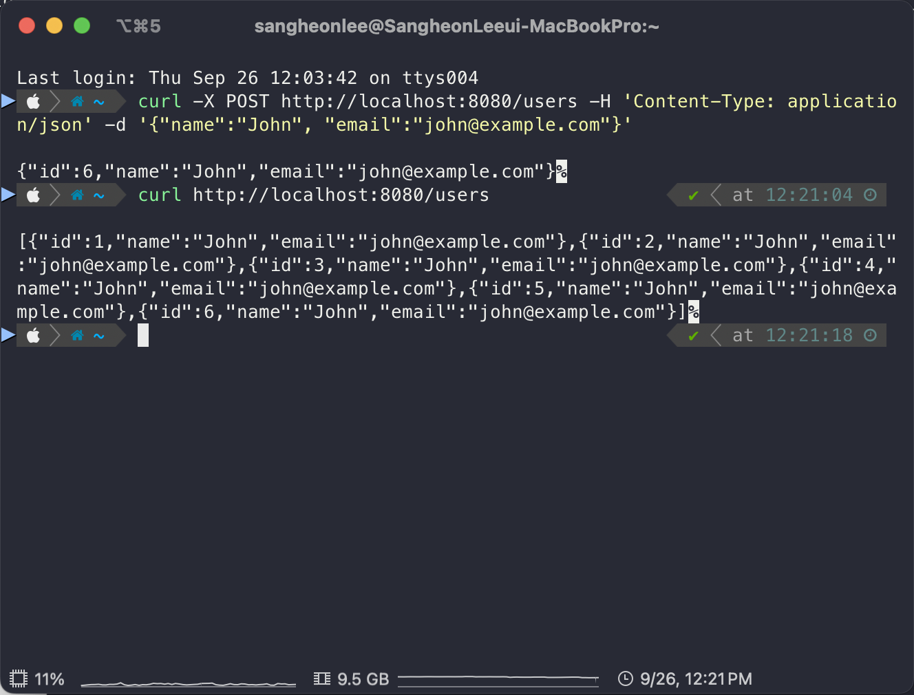
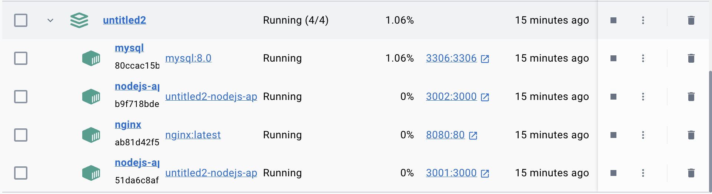

# 과제 명세

Docker Compose를 사용하여 Node.js API 서버와 MySQL 데이터베이스를 배포하고, nginx를 이용해 로드 밸런싱을 설정하는 과제입니다.
주어진 명세에 따라 각 서비스를 Docker Compose로 구성하여 적절히 동작하는지 확인하는 과제입니다.
다른 파일들은 작성해 두었기에, docker-compose.yml 파일만 작성해 주시면 됩니다.

## 목표
Docker Compose를 사용해 모든 서비스를 컨테이너로 구성하고 실행하는 과정에 있어
1. Node.js API 서버를 두 개의 인스턴스로 실행하여 수평 확장을 구현합니다.
2. MySQL 데이터베이스를 사용해 데이터를 저장하고, Node.js API에서 이를 연동합니다.
3. nginx 리버스 프록시를 사용해 로드 밸런싱을 설정합니다. 
위 3개의 요구 사항을 충족하시면 됩니다.

## 제출물
1. Node.js API 서버가 잘 동작하는지 확인하는 사진

2. 도커 컴포즈가 잘 올라갔는지 확인하는 사진

3. docker-compose.yml 파일