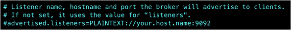

# Kafka Streams 실습

YBIGTA DE팀 24기 Kafka Streams 실습입니다.

## 개요

### 목표

- Java로 Kafka Producer와 Consumer 구현하기
- Java로 Kafka Streams 라이브러리 활용하기
- AWS에 설치된 Kafka topic과 상호작용하기

### 아키텍처 및 데이터 흐름


- User: 여러분
- 파랑: AWS에서 실행할 카프카 프로세스
- 노랑: 로컬에서 실행할 애플리케이션
- 별: Kafka Streams 라이브러리로 작성된 애플리케이션

### 프로젝트 소개

- 프로듀서 애플리케이션에 콘솔 입력(키보드)로 입력합니다.
- New line을 경계로 `ybigta` 토픽에 메세지를 프로듀스합니다.
- 스트림즈 애플리케이션이 `ybigta` 토픽을 컨슘하여, 5글자 초과인 메세지만 필터링해 `ybigta_sink` 토픽에 프로듀스합니다.
- 컨슈머 애플리케이션이 `ybigta_sink` 토픽을 컨슘하여, 사용자에게 메세지를 표시합니다.
- 메세지 확인을 편하게 하기 위해 kafka-console-consumer또한 연결합니다.

## 사전 준비

### 로컬 개발환경

- IntelliJ IDEA (Community 혹은 Ultimate)
- Java 21 이상

### Kafka EC2 인스턴스

- 지난 실습 문서와 동일하게 AWS EC2에 Kafka가 설치되어 있다고 가정합니다.
    - 보안그룹에 유의해주세요. TCP 22, 2181, 9092 포트가 개방되어 있어야 합니다.
    - 설정 충돌을 막고자, 새 EC2 인스턴스를 생성해 재설치해두시기를 권장드립니다.
    - 참고: t3.small이 t2.small 보다 10%가량 더 저렴합니다!

## 실습 - Kafka 실행 및 토픽 생성

### Kafka 서버 설정

터미널을 새로 열고, Kafka가 설치된 EC2 인스턴스에 SSH로 접속합니다.
이 터미널을 1번이라 하겠습니다.
그 후 다음 명령어를 수행합니다.

```shell
cd ~/kafka_2.13-3.7.0/
vi config/server.properties
```

Vim이 켜졌다면 다음 내용을 찾아서,



다음과 같이 주석 해제하고 public IP 주소로 고칩니다.


ESC, :, w, q, enter를 차례로 눌러 저장 후 종료합니다.

### Kafka ZooKeeper 실행

1번 터미널에서 ZooKeeper를 실행합니다.

```shell
bin/zookeeper-server-start.sh config/zookeeper.properties
```

### Kafka 브로커 실행

2번이라 부를 새 터미널을 실행하고, SSH를 연결합니다.
여기서 카프카 브로커를 실행합니다.

```shell
cd ~/kafka_2.13-3.7.0/
bin/kafka-server-start.sh config/server.properties
```

### 중간 점검

3번이라 부를 새 터미널을 실행하고, SSH를 연결합니다.
JPS를 통해 카프카 프로세스가 모두 실행되었는지 확인합니다.

```shell
jps -m
```


ZooKeeper, Kafka, JPS 3개가 있으면 정상입니다.

### 토픽 생성

3번 터미널에서 토픽을 만듭니다.

```shell
cd ~/kafka_2.13-3.7.0/
bin/kafka-topics.sh --create --topic ybigta --bootstrap-server localhost:9092
bin/kafka-topics.sh --create --topic ybigta_sink --bootstrap-server localhost:9092
```

만들어진 토픽을 확인합니다.

```shell
bin/kafka-topics.sh --bootstrap-server localhost:9092 --list
```


`ybigta`, `ybigta_sink` 2개의 토픽이 표시되면 정상입니다.

### 데이터 확인용 kafka-console-consumer 연결

3번 터미널에서 다음을 실행합니다.

```shell
bin/kafka-console-consumer.sh --topic ybigta_sink --from-beginning --bootstrap-server localhost:9092
```

아직은 아무것도 안 뜹니다.
이 친구는 토픽에 적재된 메세지를 출력만 하며, 메세지를 컨슘하지 않습니다.

여기까지 되셨다면 AWS Kafka 설정 및 실행을 정상적으로 완료하셨습니다.

## 실습 - 로컬 애플리케이션 실행

이 레포지토리를 클론하고, 인텔리제이로 엽니다.
다른 OS는 확인하지 못했으나, MacOS에서는 다음 명령어로 편하게 할 수 있습니다.
Gradle 로딩에 시간이 걸릴 수 있습니다.

```shell
git clone https://github.com/hajin-kim/ybigta-24th-de-kafka-streams
idea ybigta-24th-de-kafka-streams
```

Config 클래스에서 IP 주소를 처음에 확보한 EC2 카프카 브로커 아이피로 수정합니다.


Producer → Filter → Consumer 순서로 실행합니다.
인텔리제이 실행 설정 파일들을 레포지토리에 포함시켜뒀으며, 인텔리제이 우측 상단에서 이를 활용할 수 있습니다.


모든 애플리케이션이 실행됐다면 정상입니다.

## 테스트

로컬 Streams Producer의 콘솔에 5글자가 넘는 것, 넘지 않는 것을 입력합니다.


3번 터미널에 5글자가 초과되는 문장들만 표시되면 완료입니다.


